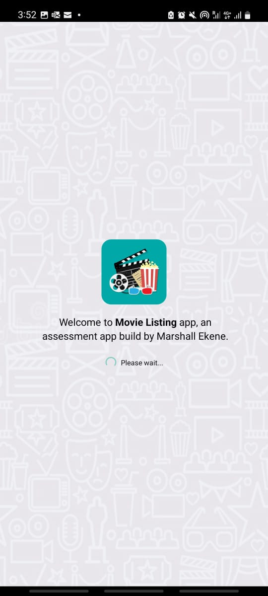
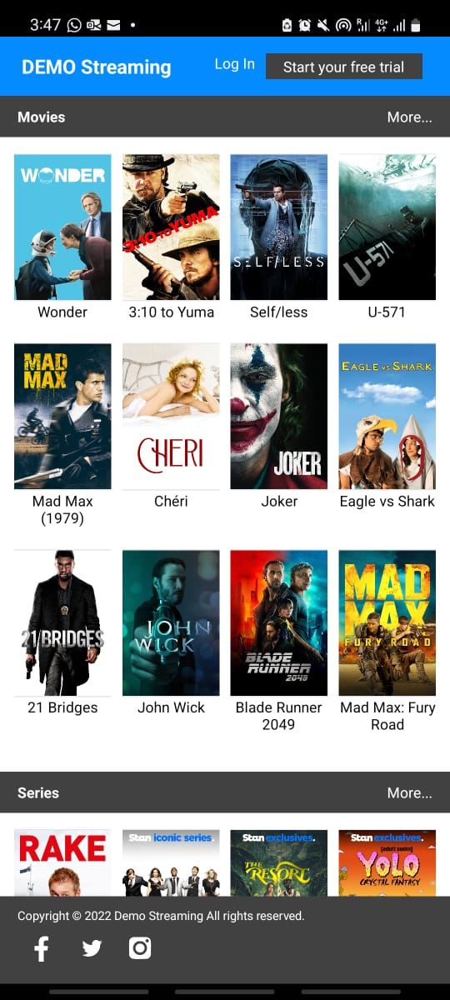
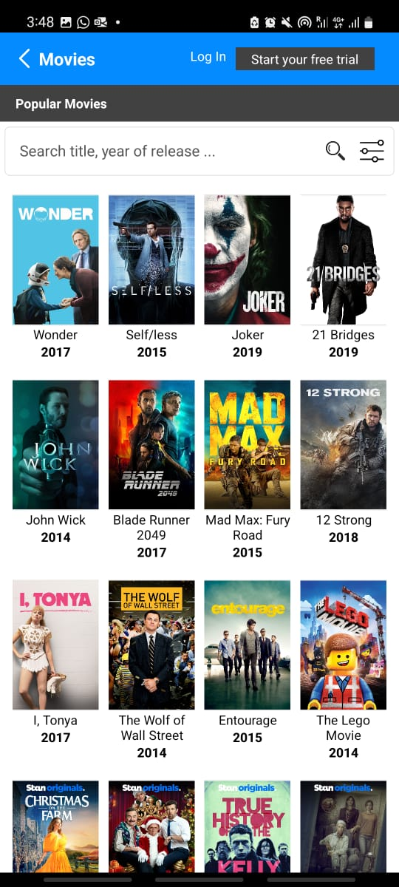
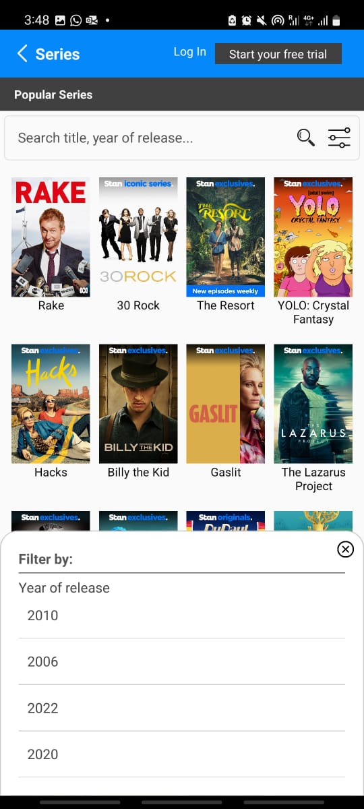
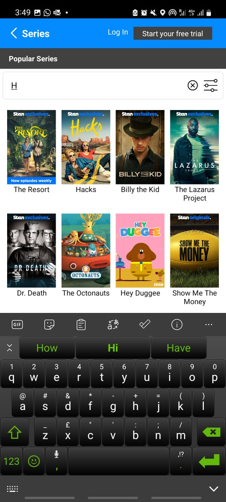

# Awabah-assessment

This app is developed for the purpose of skill assessment by Marshall Ekene using React-Native

## Video & Screenshots
<iframe src="video.mp4" width="600" height="300" ></iframe>
<table >
<tr>
<td>
<b>Splash screen</b>
 

</td>
<td>
<b>Home screen</b>
 

</td>
</tr>
<tr>
<td>
<b>Movie screen</b>
 

</td>
<td>
<b>Series screen</b>
 

 </td>
</tr>
<tr>
<td>
<b>Series with filter screen</b>
 

</td>
<td>
<b>Search screen</b>
 

</td>
</tr>
</table>

## Clone

<docgen-index>

* [`git repo cloning`](https://github.com/marshalsoft/awabah-assessment.git)

</docgen-index>

### Technology used
<docgen-index>

* [`react-native-cli`](https://reactnative.dev
)
* [`nodeJs server`](https://nodejs.org)
* [`typescript`](https://www.typescriptlang.org/)
* [`JSX`](https://reactjs.org/docs/introducing-jsx.html)

</docgen-index>

### Project Setup Architecture

* Components library containing Reusable components (UI library for all the common reusable components that can be used across the app)
* Main App Repo consuming the above UI library to build scalable and consistent screens.
* Ideally, I ensured the encapsulation of screens and components.
* Each root level folder exposes a respective index.js file that helps in shortening the imports.
* Data.json JSON feed help as database for list movies.

### Future improvements & Updates
* Provision of detail screen both in movies and series
* Pushnotification is neccesary for customers notifications
* The following screen must be added: (contact us, policies & terms,help, account, login, signup,forgot password etc.)

